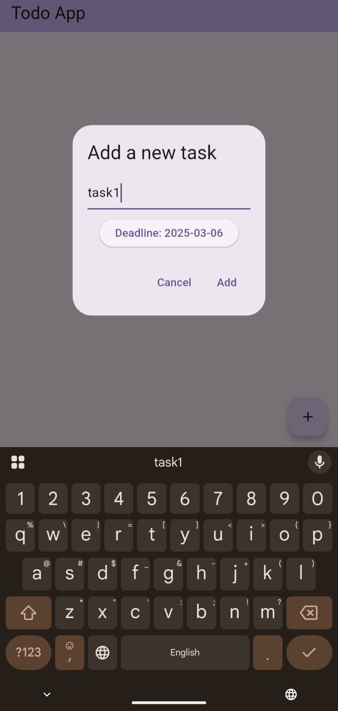
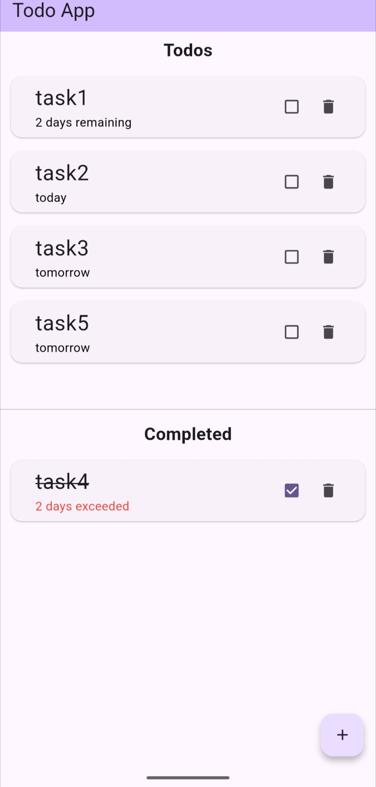

# Flutter Todo App

A simple Flutter application to manage a list of todo items.

## Getting Started

### Prerequisites

- [Flutter](https://flutter.dev/docs/get-started/install) installed on your machine.
- An IDE such as [Visual Studio Code](https://code.visualstudio.com/) or [Android Studio](https://developer.android.com/studio).

### Installation

1. **Clone the repository:**

   ```sh
   git clone https://github.com/your-username/flutter_todo_app.git
   cd flutter_todo_app
   ```

2. **Install dependencies:**

   ```sh
   flutter pub get
   ```

3. **Run the application:**

   ```sh
   flutter run
   ```

### Project Structure

- `lib/models/todo_item.dart`: Defines the `TodoItem` model class.
- `lib/main.dart`: Contains the main logic of the application, including the entry point, root widget, and home page.

### Features

- Add new todo items.
- Toggle the completion status of todo items.
- Set deadlines for todo items.
- View remaining or exceeded days for each todo item.

### Screenshots

<p float="left">
  
  
</p>

### Contributing

Contributions are welcome! Please fork the repository and submit a pull request.

### License

This project is licensed under the MIT License - see the [LICENSE](LICENSE) file for details.
